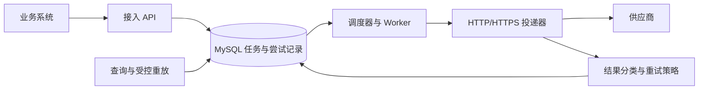
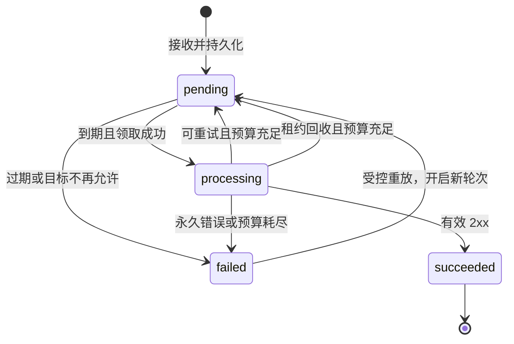

# API 通知系统设计

## 设计范围

本文说明通知服务的接入契约、模块职责、状态流转、存储和故障处理。系统接收业务方构造的 HTTP(S) 请求，持久化后异步投递，使外部接口的等待与失败处理从主业务流程中独立出来。

一条通知对应一个业务事件向一个目标发出的请求。多个目标分别建立任务，各自成功或失败，不保证跨目标原子性。业务方决定何时通知、通知谁以及正文内容，服务负责接收幂等、调度、外呼、恢复、查询和重放。

第一版收到供应商返回的有效 `2xx` 状态码（200 至 299）后，将通知标记为 `succeeded` 并停止重试。服务不检查响应正文中的业务处理结果，也不继续查询供应商是否完成后续操作。响应正文只用于有限、脱敏的诊断。

例如，某个 CRM 接口返回 HTTP `200`，但响应正文为 `{"success": false, "message": "联系人不存在"}`。这是该接口通过正文表达业务失败的例子，不是 `200` 状态码本身的含义。按第一版约定，通知服务仍将这次投递标记为成功；它无法识别这类正文中的业务失败。

另一种情况是供应商返回 HTTP `202`，表示请求已接受，但不保证处理已经完成。例如，CRM 已将更新请求放入队列，稍后才更新联系人。通知服务同样标记为投递成功，不等待或查询后续结果。这两种情况都说明：投递确认与供应商业务处理结果是不同的判断。

正文限定为有大小上限的 UTF-8 文本，支持 JSON、XML 和表单等内容，不提供文件或流式上传、WebSocket、业务字段转换、通用脚本和动态认证平台。严格顺序、跨系统事务和业务结果对账不属于第一版。库存场景按交易后的同步理解，交易时的库存预占需要独立的一致性约定。

## 可靠性边界

接收成功表示任务已提交到 MySQL，服务开始负责后续处理；投递确认成功表示取得供应商有效 `2xx` 响应。两者均不等于供应商内部业务已经完成。进程异常不能让已接收任务静默消失，自动处理停止后仍要保留原因与恢复入口。

系统采用允许重复的至少一次投递思路。供应商已执行但响应丢失，或 Worker 在记录成功前崩溃时，服务无法确定外部结果，重新发送可能重复执行。接入方需要接受重复请求，或使用供应商支持的幂等机制。供应商幂等标识在重试和重放中保持稳定，接收接口的幂等键不自动复制为供应商 Header。

自动重试受次数和有效期限制，不能保证供应商永久不可用时最终成功。持久性依赖正确的数据库配置和可恢复存储；进程恢复不代表数据库灾难零丢失，生产部署需要明确副本、备份和恢复目标。

业务事务成功后、通知尚未提交前的丢失窗口由业务方处理。需要保证事件不遗漏时，可在业务事务中同时保存待发送事件，再由后台提交到通知服务，这种模式称为 Outbox。通知服务无法自行恢复从未收到的请求。

## 技术与模块

服务使用 Go 1.26.0，module 为 `github.com/celanwang/rc_celanwang`。开发与构建环境固定同一工具链；`go.mod` 的 `go 1.26.0` 表达最低版本要求，运行平台不进入 module 配置。

MySQL 保存关系与状态，以 8.4 LTS、InnoDB 为设计基线，具体实例和补丁版本在部署配置中固定。数据访问使用 `database/sql` 与 `go-sql-driver/mysql`，关键事务采用显式 SQL；表结构通过版本化 SQL migration 管理。HTTP 使用 `net/http`，结构化日志使用 `log/slog`。

一个服务进程同时运行接入、调度和执行能力，内部按六组职责组织：

- API 处理路由、认证、输入校验、响应和错误映射。
- Notification 管理接收幂等、状态机、预算及重放规则。
- MySQL Store 提供创建、领取、完成、回收、重放和查询的事务操作。
- Worker 组织有界执行、目标轮转、任务恢复和退出协调。
- Delivery 构造一次逻辑 HTTP/HTTPS 请求，记录响应及传输事实。
- Retry Policy 根据投递结果和预算计算下一步动作、原因及执行时间。

MySQL 同时保存任务与调度状态，使接收过程不依赖数据库和消息队列双写。代价是轮询、频繁更新和历史记录占用数据库资源，需要配套索引、归档和容量验证。纯内存队列无法满足重启恢复要求。

存储、投递器、时钟和随机源可以通过小接口替换，不为每个结构体建立抽象。调用方请求的 context 只控制接收阶段，已持久化任务使用独立的后台生命周期。

## 接口契约

调用方通过外层 JSON 提交目标、URL、Method、Headers 和文本 Body，外层 `Idempotency-Key` Header 用于接收幂等。身份来自认证上下文，不能相信正文中的自报身份。查询、列表及重放均校验调用方与资源的关系。

| 接口 | 作用 |
|---|---|
| `POST /v1/notifications` | 本服务持久化接收后返回 `202`、任务 ID 和状态；此时不表示供应商已经收到通知 |
| `GET /v1/notifications/{id}` | 查询状态、调度时间、最近结果和停止原因 |
| `GET /v1/notifications/{id}/attempts` | 分页查询脱敏尝试历史 |
| `GET /v1/notifications` | 按状态和目标分页筛选 |
| `POST /v1/notifications/{id}/replays` | 管理权限下重放失败任务，提交预期轮次、理由和新有效期 |

接收以“调用方 + 幂等键”建立唯一约束。相同键和内容返回 `200` 及已有任务，不改变状态；相同键对应不同内容返回冲突。使用普通插入和唯一冲突处理，不能通过 upsert 覆盖原请求。并发冲突后读取已提交记录，再比较请求摘要。

提交结果不明、响应丢失或发生可重试接入错误时，调用方沿用原键重试。重放使用预期轮次进行条件更新，重复或陈旧操作不能开启额外轮次，可通过查询当前轮次确认结果。

错误响应包含 `request_id`、稳定错误码和安全描述。供应商状态属于投递记录，不冒充接入接口的 HTTP 状态；外层 `415` 约束提交信封格式，不约束信封内合法的 XML 或表单正文。

| 接入 HTTP 状态 | 错误码 |
|---|---|
| `400` | `INVALID_REQUEST` |
| `401` | `UNAUTHENTICATED` |
| `403` | `TARGET_NOT_ALLOWED` 或 `FORBIDDEN` |
| `404` | `NOTIFICATION_NOT_FOUND`；查询无权访问的任务同样返回不存在 |
| `409` | `IDEMPOTENCY_CONFLICT` 或 `STATE_CONFLICT` |
| `413` / `415` | `PAYLOAD_TOO_LARGE` / `UNSUPPORTED_MEDIA_TYPE` |
| `429` | `RATE_LIMITED` |
| `503` / `500` | `SERVICE_UNAVAILABLE` / `INTERNAL_ERROR` |

## 状态机

通知状态只表达任务生命周期。`pending` 表示等待首次执行或重试，`processing` 表示已领取并正在准备请求、外呼或写回，`succeeded` 表示取得 HTTP 成功确认，`failed` 表示本轮自动处理停止。失败原因和单次结果单独记录，不增加 `http_503`、`retrying` 等任务状态。

状态机由 Go 枚举、显式转移规则和 MySQL 条件更新共同约束。每次转移同时检查状态、权限或执行权，并在事务中更新相关数据。`failed` 不证明供应商没有执行，`succeeded` 不提供重放入口；重复提交也不会触发重放。

有效期限定最晚开始新尝试的时间。在有效期内开始的请求，不能仅因响应到达时过期就丢弃成功；其执行仍受总超时和当前领取权约束。

## 执行与恢复

调度器按目标轮转，仅在 Worker 和目标均有空闲容量时领取任务。领取数量不超过可执行数量，避免任务提前占用租约却仍在本地等待。

一次执行的事务边界如下：

1. 开启短事务，以 `SELECT … FOR UPDATE SKIP LOCKED` 锁定该目标已到期且未过期的任务。
2. 更新为 `processing`，生成领取令牌与租约，增加尝试编号和本轮计数，建立未完成的尝试记录。
3. 提交成功后发送 HTTP。领取提交结果不明时不发送，交由后续回收处理。
4. 外呼结束后开启新事务，以 `id + status + lease_token` 校验当前执行权，同时完成尝试记录和任务转移。
5. 成功则进入 `succeeded`；允许重试则写入下次执行时间并回到 `pending`；永久错误、过期或预算耗尽则进入 `failed`。结束当前执行权时清理租约。

外部请求始终在事务外执行。调度事务使用显式 `READ COMMITTED`，租约与调度时间统一采用数据库 UTC 时间，过期回收与到期领取分别查询。启用复制时使用兼容的行格式日志。

租约过期表示任务可以被回收，不自动撤销令牌。回收方锁定任务，核实租约，将未完成尝试记为结果不确定，撤销令牌，再按预算回到 `pending` 或进入 `failed`。成功写回与回收竞争同一行锁，先提交者决定结果；回收提交后，旧 Worker 的条件更新必须失败。

数据库死锁只触发有限的事务重试，结果写回重试不能直接再次外呼。写回提交结果不明时，先查询任务与尝试确认；无法确认则保留恢复路径。领取令牌防止本地状态被覆盖，但不能撤回已经发给供应商的请求。

正常停机先停止领取，再等待有界时间完成在途请求。超时取消保留可恢复状态，不统一记成供应商故障。领取已经计为一次执行尝试，即使崩溃前尚未发送，也占用预算；尝试计数不是准确的网络发送次数。

## HTTP 传输

投递模块支持配置范围内的 HTTP/HTTPS URL，方法白名单为 GET、POST、PUT、PATCH、DELETE。请求正文按已保存字节重新构造，不重新序列化业务内容；Headers 支持多值，协议控制字段由客户端管理。

目标必须匹配调用方权限，同时校验协议、主机、端口和实际连接地址。限制未授权私网、回环、链路本地等地址，防止 DNS 重绑定绕过。测试目标使用独立配置，代理显式启用，避免运行环境意外改变连接路径。

HTTPS 校验证书链和域名，最低 TLS 1.2；私有 CA 通过独立信任配置接入，不跳过验证，也不自动降级到 HTTP。关闭自动重定向，使用 `http.ErrUseLastResponse` 取得原始响应。连接目标的地址校验不能破坏基于域名的 TLS 验证。

调用方接入认证与供应商凭证分开。供应商静态凭证在发送时按目标配置引用注入，不转发接入 Authorization；拒绝非法 Header 和凭证冲突。Host、Content-Length、Connection、Transfer-Encoding 等字段不由调用方直接控制。动态签名与令牌刷新需要独立的协议支持，不能把过期签名固定重放。

Client 与 Transport 复用，分别配置连接、TLS 握手、响应头和总超时。总超时覆盖连接等待、发送及响应读取，各阶段上限不是简单相加。请求、响应头和诊断正文有大小上限；关闭响应 Body，不为连接复用无限读取内容。

Go 的 `Do` 在收到非 `2xx` 时通常没有 Go error，必须检查响应状态。Transport 在特定网络条件下可能自动重试，幂等 Header 也会影响其判断。因此一次 attempt 表示一次逻辑投递执行，不声称只发生一次网络发送，也不额外叠加 SDK 重试循环。

有效 `2xx` 响应头已经满足成功契约。诊断正文截断、超限或读取失败只记录诊断信息，不触发重发；连接建立或 TLS 握手成功本身不算投递成功。

## 错误与重试

投递器记录取得了什么响应、错误发生在哪个阶段，以及能否确认请求未发送。输出包括 `http_status`、`error_code`、`phase`、`delivery_evidence`、`retry_after`、耗时和脱敏摘要。未取得有效响应时，HTTP 状态为空，不伪造 `502` 或 `504`。

Go 错误通过 `errors.Is/As` 解包，主要类别不依赖字符串匹配。发送中断、响应超时或连接重置无法直接证明供应商未执行；证据不足时保留不确定性。收到 `500` 等错误响应也可能已经产生业务副作用。

| 投递结果 | 默认动作 |
|---|---|
| 有效 `2xx` | 成功，不解析业务码或轮询后续结果 |
| `3xx`、协议升级 `101` | 停止并记录配置或协议问题；其他 `1xx` 是中间响应 |
| `408`、`429` | 有限重试，处理有效的 `Retry-After` |
| 其余 `4xx` | 停止；`409` 不自动视为重复成功 |
| `500/502/503/504` 及其他未特判 `5xx` | 退避重试 |
| `501/505` | 停止，功能或协议不支持 |
| DNS 超时、连接失败、TLS 握手超时 | 有限重试 |
| 非法目标、明确域名不存在、无效证书 | 停止，修复配置后重放 |
| 发送中断、响应超时、异常 EOF 或连接重置 | 保留结果不确定性，有限重试 |
| 无法解析有效 HTTP 响应 | 记录协议错误与不确定性，有限重试 |
| 本地停机取消 | 保留恢复路径，不归因为供应商故障 |

策略模块结合分类、尝试次数和有效期，输出成功、重试或停止。接入时已发现非法请求则拒绝接收，持久化后才发现目标撤权等问题则进入 `failed`。停止原因如 `PERMANENT_ERROR`、`RETRY_EXHAUSTED`、`EXPIRED` 与最近错误分别保存，便于识别“为什么停止”和“此前发生什么”。

第 k 次重试的退避上限为 `min(最大间隔, 基础间隔 × 2^(k-1))`，在此范围随机取值并设置最小等待。下次执行不早于有效 `Retry-After`，同时支持秒数和 HTTP 日期；无效值回退到退避，要求等待的时间超过有效期则停止，不能提前重试。

次数与有效期任一先耗尽就停止。有限次数可能早于有效期耗尽，不代表持续重试完整个时间窗口。保留任务、尝试与停止原因，使长期失败可以被查询、修复和重放。

## 数据设计

`notification` 保存一条通知的当前状态与请求，`notification_attempt` 保存它的多次逻辑执行。两张表均使用事务引擎，影响查询、唯一性和调度的字段单独建列。

### 通知任务

任务身份由 `id`、`caller_id`、`idempotency_key` 和 `request_hash` 表达。请求包含 `target_id`、URL、Method、Headers、Body 及必要的策略快照或版本。运行状态使用 `status`、`run_no`、`run_attempt_count`、`last_attempt_no`、预算、`next_attempt_at`、`expires_at`、`lease_token` 和 `lease_until`。

任务同时保存最近结果、`stop_reason`、创建、更新和结束时间。`run_no` 区分首次执行与重放，尝试预算按轮次计算。低频重放操作在 `replay_history` JSON 中随状态转移原子追加操作者、理由、轮次、时间和新有效期，保留重放后再次领取前的操作证据；审计量增长后独立存储，避免历史长期膨胀。

Body 使用二进制字段保存已校验的 UTF-8 字节。Headers 比较时归一化名称、保留值序列，请求摘要使用确定性编码，包含稳定请求内容，不包含运行时轮换凭证。幂等键使用明确的二进制比较和长度限制，避免大小写或空白比较歧义。

凭证按引用加载，非敏感请求和策略保留快照，重试仍检查当前访问权限。目标撤权优先于旧快照，不因历史授权继续发送。

### 投递尝试

每条尝试保存 `id`、`notification_id`、`run_no`、`attempt_no`、开始和结束时间、`result`、HTTP 状态、错误类别、阶段、结果证据、耗时及脱敏摘要。`attempt_no` 在任务内累计递增，重放不归零。

尝试结果区分未完成、HTTP 成功、HTTP 非成功、传输错误和恢复后不确定。某次尝试失败时，任务仍可能等待重试；存在尝试记录，也不能证明请求一定已经发送。

### 约束与保留

| 用途 | 约束或索引 |
|---|---|
| 接收去重 | `UNIQUE(caller_id, idempotency_key)` |
| 按目标领取 | `(target_id, status, next_attempt_at, id)` |
| 租约回收 | `(status, lease_until, id)` |
| 尝试编号与查询 | `UNIQUE(notification_id, attempt_no)` |

活动任务不清理，终态任务与关联尝试按保留期限清理。幂等记录清理后原窗口结束，再使用旧键可能创建新通知，保留期限必须覆盖约定的调用方重试窗口。

## 运行保障

Worker 全局并发与单目标并发分别受限，按目标公平选择可执行任务。单个供应商持续超时或失败时，降低其发送频率，其他目标继续获得容量。第一版限制作用于单进程，不视为多副本全局配额。

积压设置可配置软水位，超过后拒收新任务并说明原因。软水位不是并发下的精确配额，不能据此删除已接收任务。数据库或存储不可用时停止确认接收，健康检查分别表达进程存活和能否可靠接收。

重放只作用于 `failed`。操作者确认通知仍有业务意义，提交预期轮次、理由和新有效期；服务原子开启新轮次，保留历史和原供应商幂等标识。修改正文属于新的业务请求，不能通过重放悄悄改变原任务。

日志关联任务、尝试、目标、轮次和状态变化，敏感 URL 参数、Header、正文及原始错误必须脱敏。基础指标覆盖接收量、积压量、最老等待时间、按目标的成功与失败、重试、外呼耗时、超时、租约回收及数据库错误。持续失败需要告警规则和处置方式；实际告警渠道由部署环境接入，日志本身不等于告警已经生效。

## 演进条件

方案将变化较少的可靠性规则集中在状态机和事务边界中，以小接口隔离 HTTP 与存储。显式 SQL、两张核心表和单服务部署对应当前需求，不预先建设通用工作流、独立队列或供应商插件平台。

数据库在索引、批量处理和历史归档后仍出现调度瓶颈时，再评估消息队列，同时处理发布一致性和重复消费。API 与外呼争用资源时分离 Worker 部署，多副本超过供应商配额时增加全局目标限流。

新的业务要求需要分别评估：同一对象有序会引入失败阻塞和版本处理；实时签名需要认证适配；正文业务码、异步完成和对账会改变成功契约。每项扩展都应对应明确的业务问题或运行证据。
